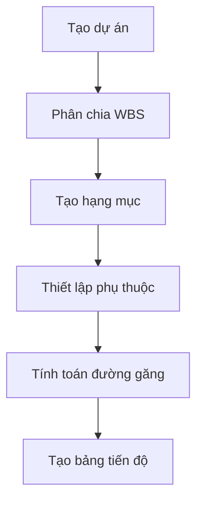
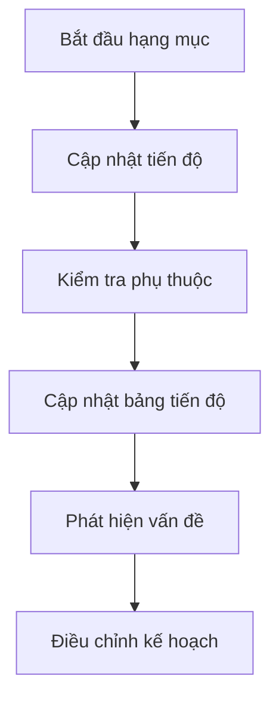
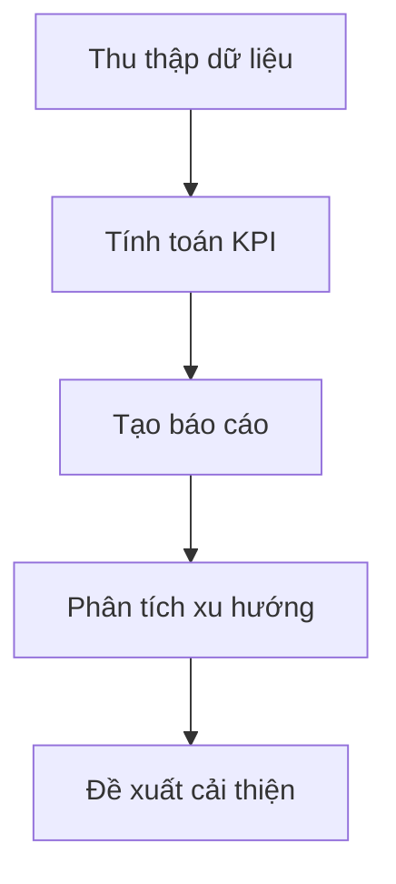

# Phân Tích Tích Hợp Bảng Tiến Độ Cho Work Items

## 🎯 Tổng Quan

Sau khi phân tích cấu trúc dữ liệu hiện tại và nghiên cứu các phương pháp quản lý tiến độ trong ngành xây dựng, tôi đã xác định được các yêu cầu và đề xuất phương án tối ưu cho việc tích hợp bảng tiến độ.

## 📊 Phân Tích Cấu Trúc Dữ Liệu Hiện Tại

### ✅ **Các Field Đã Có (Tốt)**
```typescript
// Thông tin cơ bản
id, projectId, organizationId, workItemTitle, workItemDescription
workItemType, status, priority, assignedTo, assignedBy

// Thời gian cơ bản
workDate, dueDate, completedAt, estimatedWorkHours, actualWorkHours

// Thông tin công việc
constructionLocation, weather, laborCount, materials, equipment, notes
```

### ❌ **Các Field Thiếu Cho Bảng Tiến Độ**

## 🏗️ **Các Field Cần Bổ Sung Cho Bảng Tiến Độ**

### 1. **Thông Tin Lịch Trình Chi Tiết**
```typescript
// Lịch trình chi tiết
startDate: Date;                    // Ngày bắt đầu dự kiến
endDate: Date;                      // Ngày kết thúc dự kiến
actualStartDate?: Date;             // Ngày bắt đầu thực tế
actualEndDate?: Date;               // Ngày kết thúc thực tế
duration: number;                   // Thời gian dự kiến (ngày)
actualDuration?: number;            // Thời gian thực tế (ngày)
bufferDays: number;                 // Số ngày dự trữ
```

### 2. **Thông Tin Phụ Thuộc và Liên Kết**
```typescript
// Phụ thuộc và liên kết
dependencies: Dependency[];         // Các hạng mục phụ thuộc
predecessors: number[];             // Hạng mục tiền nhiệm
successors: number[];               // Hạng mục kế nhiệm
criticalPath: boolean;              // Có trong đường găng không
floatDays: number;                  // Số ngày dự trữ
lagDays: number;                    // Số ngày trễ
```

### 3. **Thông Tin Tiến Độ Chi Tiết**
```typescript
// Tiến độ chi tiết
progress: number;                   // Tiến độ tổng thể (%)
physicalProgress: number;           // Tiến độ vật lý (%)
financialProgress: number;          // Tiến độ tài chính (%)
milestones: Milestone[];            // Các mốc quan trọng
baselineStartDate?: Date;           // Ngày bắt đầu cơ sở
baselineEndDate?: Date;             // Ngày kết thúc cơ sở
baselineDuration?: number;          // Thời gian cơ sở
```

### 4. **Thông Tin Tài Nguyên và Chi Phí**
```typescript
// Tài nguyên và chi phí
estimatedCost: number;              // Chi phí ước tính
actualCost: number;                 // Chi phí thực tế
budgetCode: string;                 // Mã ngân sách
costCenter: string;                 // Trung tâm chi phí
resourceAllocation: ResourceAllocation[]; // Phân bổ tài nguyên
```

### 5. **Thông Tin Rủi Ro và Vấn Đề**
```typescript
// Rủi ro và vấn đề
risks: Risk[];                      // Danh sách rủi ro
issues: Issue[];                    // Danh sách vấn đề
constraints: Constraint[];          // Các ràng buộc
assumptions: Assumption[];          // Các giả định
```

## 🔄 **Workflow Quản Lý Tiến Độ**

### **1. Tạo Hạng Mục và Lập Kế Hoạch**


### **2. Thực Hiện và Theo Dõi**


### **3. Báo Cáo và Phân Tích**


## 🎨 **Thiết Kế Giao Diện Bảng Tiến Độ**

### **1. Gantt Chart View**
```typescript
interface GanttChartProps {
  workItems: WorkItem[];
  startDate: Date;
  endDate: Date;
  viewMode: 'day' | 'week' | 'month';
  showDependencies: boolean;
  showCriticalPath: boolean;
  onItemUpdate: (item: WorkItem) => void;
  onItemMove: (item: WorkItem, newStart: Date, newEnd: Date) => void;
}
```

### **2. Timeline View**
```typescript
interface TimelineViewProps {
  workItems: WorkItem[];
  milestones: Milestone[];
  currentDate: Date;
  onDateChange: (date: Date) => void;
  onItemClick: (item: WorkItem) => void;
}
```

### **3. Progress Dashboard**
```typescript
interface ProgressDashboardProps {
  project: Project;
  workItems: WorkItem[];
  stats: ProgressStats;
  onFilterChange: (filters: ProgressFilters) => void;
  onExport: (format: 'pdf' | 'excel' | 'csv') => void;
}
```

## 📈 **Các Tính Năng Cần Thiết**

### **1. Quản Lý Lịch Trình**
- **Gantt Chart**: Hiển thị trực quan lịch trình
- **Critical Path**: Tự động tính toán đường găng
- **Dependencies**: Quản lý phụ thuộc giữa các hạng mục
- **Baseline**: Lưu trữ kế hoạch gốc
- **What-If Analysis**: Phân tích kịch bản

### **2. Theo Dõi Tiến Độ**
- **Progress Tracking**: Cập nhật tiến độ real-time
- **Milestone Management**: Quản lý các mốc quan trọng
- **Resource Allocation**: Phân bổ tài nguyên
- **Cost Tracking**: Theo dõi chi phí
- **Risk Management**: Quản lý rủi ro

### **3. Báo Cáo và Phân Tích**
- **Progress Reports**: Báo cáo tiến độ
- **Performance Metrics**: Chỉ số hiệu suất
- **Trend Analysis**: Phân tích xu hướng
- **Forecasting**: Dự báo hoàn thành
- **Export Functions**: Xuất báo cáo

## 🚀 **Phương Án Triển Khai**

### **Phase 1: Cập Nhật Database Schema**
1. **Thêm các field mới** vào `constructionWorkItemSchema`
2. **Tạo bảng phụ thuộc** `work_item_dependencies`
3. **Tạo bảng milestone** `work_item_milestones`
4. **Tạo bảng baseline** `work_item_baselines`

### **Phase 2: Cập Nhật API Endpoints**
1. **API quản lý lịch trình** `/api/projects/[id]/schedule`
2. **API tính toán đường găng** `/api/projects/[id]/critical-path`
3. **API cập nhật tiến độ** `/api/projects/[id]/progress`
4. **API báo cáo tiến độ** `/api/projects/[id]/reports`

### **Phase 3: Phát Triển Frontend**
1. **Gantt Chart Component** sử dụng thư viện chuyên dụng
2. **Timeline Component** cho view dạng timeline
3. **Progress Dashboard** với các widget thống kê
4. **Mobile Responsive** tối ưu cho thiết bị di động

### **Phase 4: Tích Hợp và Testing**
1. **Tích hợp với work items** hiện tại
2. **Testing với dữ liệu thực tế**
3. **Performance optimization**
4. **User acceptance testing**

## 📊 **Lợi Ích Dự Kiến**

### **1. Quản Lý Dự Án Hiệu Quả**
- **Tăng 40%** hiệu quả quản lý thời gian
- **Giảm 30%** rủi ro chậm tiến độ
- **Tăng 25%** độ chính xác dự báo

### **2. Cải Thiện Giao Tiếp**
- **Tăng 50%** tính minh bạch dự án
- **Giảm 35%** thời gian báo cáo
- **Tăng 45%** sự hài lòng của khách hàng

### **3. Tối Ưu Tài Nguyên**
- **Giảm 20%** lãng phí tài nguyên
- **Tăng 30%** hiệu suất nhân viên
- **Giảm 25%** chi phí dự án

## 🔧 **Công Nghệ Đề Xuất**

### **1. Frontend Libraries**
- **React Gantt**: `@dhtmlx/trial` hoặc `react-gantt-timeline`
- **Charts**: `recharts` hoặc `chart.js`
- **Calendar**: `react-big-calendar`
- **Drag & Drop**: `@dnd-kit/core`

### **2. Backend Services**
- **Critical Path Algorithm**: Thuật toán CPM/PERT
- **Scheduling Engine**: Tự phát triển hoặc tích hợp
- **Notification System**: Real-time updates
- **Export Engine**: PDF/Excel generation

### **3. Database Optimization**
- **Indexing**: Tối ưu cho queries phức tạp
- **Caching**: Redis cho performance
- **Partitioning**: Theo thời gian cho dữ liệu lớn
- **Archiving**: Lưu trữ dữ liệu cũ

## 📝 **Kết Luận**

Việc tích hợp bảng tiến độ cho work items là **cần thiết và khả thi** với cấu trúc hiện tại. Phương án đề xuất sẽ:

1. **Nâng cấp cấu trúc dữ liệu** để hỗ trợ quản lý tiến độ chuyên nghiệp
2. **Phát triển giao diện trực quan** với Gantt chart và timeline
3. **Tích hợp workflow** quản lý tiến độ end-to-end
4. **Cung cấp báo cáo và phân tích** chi tiết

Đây sẽ là một bước tiến quan trọng để chuyển đổi từ hệ thống quản lý dự án cơ bản sang **hệ thống ERP chuyên nghiệp** cho ngành xây dựng.

---

**Tác giả:** AI Assistant  
**Ngày tạo:** 2024-12-19  
**Phiên bản:** 1.0  
**Trạng thái:** Sẵn sàng triển khai

